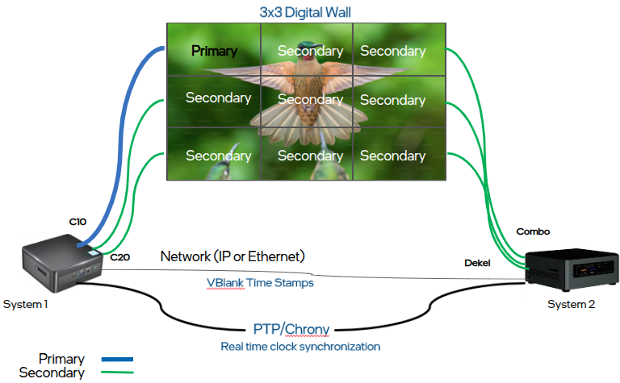
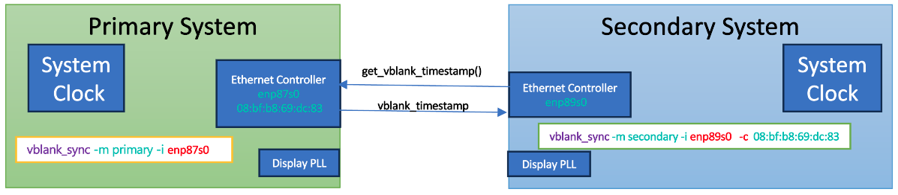
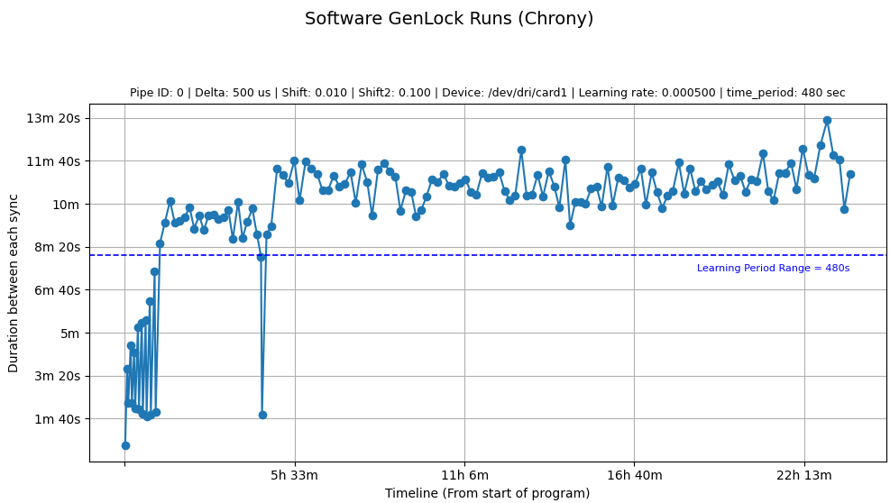

 Copyright (C) 2025 Intel Corporation
 SPDX-License-Identifier: MIT

# Introduction to SW Genlock
SW Genlock is a software-based solution designed to **synchronize the display refresh (vblank) signals** across multiple computer systems with high-precision microsecond-level accuracy. It ensures that the vertical blanking intervals (vblanks) of all connected displays occur in tight alignment, enabling seamless, tear-free visual output across multiple screens. Such synchronization is critical in environments like video walls, virtual reality setups, digital signage, and other multi-display configurations where visual continuity is essential.

In use cases such as digital signage, there are typically **two levels of synchronization** required:

* **Low-level synchronization** of the display hardware to align the vblanks across systems, and

* **High-level synchronization** by the application to ensure that decoded frames are delivered in sync with those vblanks.

SW Genlock addresses the **first, low-level synchronization** layer, making sure that the vblank signals are precisely aligned across all participating systems. This provides a reliable foundation for applications to build on and manage frame-level synchronization effectively.

In addition to precise timing, SW Genlock features an `adaptive clock alignment mechanism` that allows secondary systems to gradually adjust their internal clocks to match the primary system. Through permanent, micro-scale adjustments controlled by a tunable learning rate, the system "learns" and adapts over time, reducing synchronization overhead and increasing long-term stability. This makes SW Genlock ideal for continuous, low-maintenance operation across varied hardware environments.

## Key Features of SW Genlock

- **High Precision Synchronization**: Ensures that vertical sync (vblank) intervals occur simultaneously across all connected systems, maintaining the integrity of visual displays.
- **Flexible Integration**: Offers both dynamic (.so) and static (.a) linking options to accommodate various application needs.
- **Comprehensive Tools**: Includes a suite of tools and libraries that facilitate the synchronization process, such as obtaining vblank timestamps and adjusting the phase-locked loop (PLL) frequencies.
- **Extensive Compatibility**: SW Genlock supports a wide range of system configurations, including mixed platform generations (e.g., Tiger Lake, Panther Lake) and various Linux distributions such as Ubuntu 22.04 and 24.04. It offers flexibility in real-time clock synchronization setups by supporting both Precision Time Protocol (PTP) for high-precision environments and Chrony for simpler or less time-sensitive deployments. This makes it suitable for diverse hardware and OS combinations across development and production environments.
- **Adaptive Clock Alignment:** Implements optional, micro-scale permanent clock adjustments using a tunable learning rate. This adaptive mechanism helps secondary systems gradually align with the primary clock, reducing sync frequency and improving long-term stability with minimal overhead.
- **User-Centric Utilities**: Provides reference applications that demonstrate effective usage of the library, assisting users in integrating Genlock capabilities into their own projects.

The SW Genlock system operates by aligning the internal clocks of all systems involved, ensuring that every display refresh is triggered simultaneously. This alignment is achieved through the utilization of industry-standard protocols and our advanced algorithms, which manage the synchronization over ethernet or direct network connections.

<div align="center">
  <figure>
    
    <figcaption>Figure: SW GenLock</figcaption>
  </figure>
</div>

# Supported Platforms

Platforms based on the following architectures should be supported:

- Tiger Lake
- Alder Lake
- Raptor Lake
- Meteor Lake
- Arrow Lake
- Panther Lake

## Important Notes
* This tool requires root privileges (e.g., via sudo) by default, as it accesses the PCI address space directly. Alternatively, users may configure appropriate permissions or use cgroup-based access control to avoid running as root. Please note that the accompanying reference applications do not handle this, and it is the user's responsibility to ensure proper permissions are set up.

* The vsync_test reference application provided is intended for demonstration purposes only. It uses unencrypted socket communication to send and receive VBlank timestamps. Users are strongly encouraged to implement appropriate encryption and security measures for any production or real-world deployment.

# Installation

Installing SW Genlock involves a few straightforward steps. This section guides through the process of setting up SW Genlock on target systems, ensuring that user have everything needed to start synchronizing displays.

## System Requirements

Before the user begin the installation, ensure the systems meet the following criteria:

The build system assumes the following, prior to executing the build steps:

1) The system has [Ubuntu 22.04 or 24.04](https://ubuntu.com/tutorials/install-ubuntu-desktop#1-overview).  Other Linux flavors should work too.
1) Libraries installed: `sudo apt install -y git build-essential make`
1) [Disable secure boot](https://wiki.ubuntu.com/UEFI/SecureBoot/DKMS)
1) MUST apply the matching [PLL kernel patch](./resources/shared_dpll-kernel-6.10+.patch) located in resources folder.

	Apply shared_dpll-kernel-x.x.patch according to kernel version.  e.g shared_dpll-kernel-6.10+.patch applicable from 6.10 till 6.13.  6.14 has its own patch in resource directory.

		e.g patch -p1 < <SWGenLockdir>/resources/shared_dpll-kernel-6.10+.patch

   Compile the kernel and update either the entire kernel or just the i915.ko/xe.ko module, depending on the Linux configuration. Note: In some setups, the i915.ko/xe.ko module is integrated into the
   initrd.img, and updating it in /lib/module/... might not reflect the changes.
   - Following the application of the patch, edit the grub settings:
 ```console
 $ sudo vi /etc/grub/default
 # add i915.share_dplls=0 to the GRUB_CMDLINE_LINUX options:
 # GRUB_CMDLINE_LINUX="i915.share_dplls=0"
 # Save and exit, then update grub
 update-grub
 ```

1) Apply **[the monotonic timstamp patch](./resources/0001-Revert-drm-vblank-remove-drm_timestamp_monotonic-par.patch)**
 to Linux kernel drm module which allows it to provide vsync timestamps in real time
 instead of the default monotonic time.<br>
 Note that the monotonic timestamp patch is generated based on Linux v6.4 and has been tested upto v6.15.<br>
 Please follow the steps to disable monotonic timestamp after installing the local built Linux image on a target. Compile the kernel and update either the entire kernel or just the drm.ko module based on the installed Linux configuration. <br>
  1. Add ```drm.timestamp_monotonic=0``` option to **GRUB_CMDLINE_LINUX** in /etc/default/grub
  2. Update **GRUB_DEFAULT** in /etc/default/grub to address the local built Linux image
  3. Run ```update-grub``` to apply the change
  4. Reboot a target
1) Turn off NTP time synchronization service by using this command:
 ```timedatectl set-ntp no```
1) All the involved systems should support PTP time synchronization via ethernet (e.g ptp4l, phc2sys)
   To verify if an ethernet interface supports PTP, the `ethtool` linux tool can be used. Run the following command, replacing `eth0` with the relevant interface name:

   ```console
   $ ethtool -T eth0
   ```

   If the interface supports PTP, the output will display specific PTP hardware clock information.
   To ensure proper synchronization, the Ethernet interfaces on the involved systems should be directly connected either via a crossover cable or through a PTP-supported router or switch. If the systems only have a single network interface, it may be necessary to add a separate network adapter, such as a USB-to-Ethernet or USB-to-WiFi dongle, to maintain SSH access and connectivity to external networks.

	Alternatively, `Chrony` can be used for real-time clock synchronization. While it offers easier setup and broader compatibility, its precision is generally lower, and time drift may not be as stable compared to hardware-assisted PTP.

1) Displays must be at same refresh rate (e.g 60Hz)

## Build steps

1) Git clone this repository
1) `sudo apt install libdrm-dev libpciaccess-dev`
    1) If the directory /usr/include/drm does not exist, it may be necessary to run the command`sudo apt install -y linux-libc-dev`
2) Type `make` from the main directory. It compiles everything and creates library and executable binaries in respective folders along with code which can then be copied to the target systems.

# Software Components

## Vsync Library

The Vsync library is distributed in both dynamic (.so) and static (.a) binary formats, allowing users to choose between dynamic and static linking depending on their application requirements. This library includes essential functions such as retrieving vblank timestamps and adjusting the vblank timestamp drift by specified microseconds. Additionally, all operations related to Phase-Locked Loop (PLL) programming are encapsulated within the library, providing a comprehensive suite of tools for managing display synchronization.

### 🔧 Static Library (.a)
When linking against the static library (libvsyncalter.a), the final binary must be linked using g++ rather than gcc. This is because the static library contains C++ object code but does not include the C++ standard library symbols (e.g., operator new, std::mutex, virtual tables).

```bash
$ g++ -o app main.c libvsyncalter.a -lpciaccess -ldrm -lrt -lm
```

Linking with gcc in this case will typically result in undefined reference errors to C++ runtime symbols.

### 🔧 Shared Library (.so)
When using the shared library version (libvsyncalter.so), the final binary can be linked using either gcc or g++. All necessary C++ symbols are already resolved and included in the shared object.

The system dynamic linker will load the required C++ runtime (libstdc++) at runtime.

```bash
$ gcc -o app main.c -L. -lvsyncalter -lpciaccess -ldrm -lrt -lm
```

This allows the shared library to be used safely from C code, since the C++ functions in vsync lib are exposed with C-compatible linkage (i.e., using extern "C" in headers). The reference applications are linked using g++, while the unit tests are compiled with gcc to ensure compatibility with the pure C interface.

## Reference Applications

Accompanying the library, three reference applications are provided to demonstrate how to utilize the library effectively. These include:

- A `vsync test` app that runs in either primary mode or secondary mode.  primary mode is run on a single PC whereas all other PCs are run as secondary mode with parameters pointing to primary mode system ethernet address.  The communication is done either in ethernet mode or IP address mode.

```console
Usage: ./vsync_test [-m mode] [-i interface] [-c mac_address] [-d delta] [-p pipe] [-s shift] [-v loglevel] [-h]
Options:
  -m mode           Mode of operation: pri, sec (default: pri)
  -i interface      Network interface to listen on (primary) or connect to (secondary) (default: 127.0.0.1)
  -c mac_address    MAC address of the network interface to connect to. Applicable to ethernet interface mode only.
  -d delta          Drift time in microseconds to allow before pll reprogramming (default: 100 us)
  -p pipe           Pipe to get stamps for.  4 (all) or 0,1,2 ... (default: 0)
  -s shift          PLL frequency change fraction as percentage (default: 0.01 = 0.01%)
  -x shift2         PLL frequency change fraction for large drift (default: 0.0; Disabled)
  -f frequency      PLL clock value to set at start (default -> Do Not Set : 0.0)
  -e device         Device string (default: /dev/dri/card0)
  -v loglevel       Log level: error, warning, info, debug or trace (default: info)
  -k time_period    Time period in seconds during which learning rate will be applied.  (default: 240 sec)
  -l learning_rate  Learning rate for convergence. Secondary mode only. e.g 0.00001 (default: 0.0  Disabled)
  -o overshoot_ratio Allow the clock to go beyond zero alignment by a ratio of the delta (value between 0 and 1).
                        For example, with -o 0.5 and delta=500, the target offset becomes -250 us in the apposite direction (default: 0.0)
  -t step_threshold Delta threshold in microseconds to trigger stepping mode (default: 1000 us)
  -w step_wait      Wait in milliseconds between steps (default: 50 ms)
  -n                Use DP M & N Path. (default: no)
  -h                Display this help message
```

* A `vbltest` app to print average vblank period between sync.  This is useful in verification and validation.

```console
[INFO] Vbltest Version: 2.0.0
 Usage: ./vbltest [-p pipe] [-c vsync_count] [-v loglevel] [-h]
 Options:
  -p pipe        Pipe to get stamps for.  0,1,2 ... (default: 0)
  -c vsync_count Number of vsyncs to get timestamp for (default: 300)
  -e device      Device string (default: /dev/dri/card0)
  -l loop        Loop mode: 0 = no loop, 1 = loop (default: 0)
  -v loglevel    Log level: error, warning, info, debug or trace (default: info)
  -h             Display this help message
```

* A `synctest` app to drift vblank clock on a single display by certain period such as 1000 microseconds (or 1.0 ms).

```console
[INFO] Synctest Version: 2.0.0
Usage: ./synctest [-p pipe] [-d delta] [-s shift] [-v loglevel] [-h]
Options:
  -p pipe            Pipe to get stamps for.  0,1,2 ... (default: 0)
  -d delta           Drift time in us to achieve (default: 1000 us) e.g 1000 us = 1.0 ms
  -s shift           PLL frequency change fraction (default: 0.01)
  -x shift2          PLL frequency change fraction for large drift (default: 0.0; Disabled)
  -e device          Device string (default: /dev/dri/card0)
  -f frequency       Clock value to directly set (default -> Do not set : 0.0)
  -v loglevel        Log level: error, warning, info, debug or trace (default: info)
  -t step_threshold  Delta threshold in microseconds to trigger stepping mode (default: 1000 us)
  -w step_wait       Wait in milliseconds between steps (default: 50 ms)
  --no-reset         Do no reset to original values. Keep modified PLL frequency and exit (default: reset)
  --no-commit        Do no commit changes.  Just print (default: commit)
  -m                 Use DP M & N Path. (default: no)
  -h                 Display this help message
```

**synctest sample output:**

```console
$ ./synctest
[INFO] Synctest Version: 2.0.0
[INFO] DRM Info:
[INFO]   CRTCs found: 4
[INFO]    Pipe:  0, CRTC ID:   80, Mode Valid: Yes, Mode Name: , Position: (   0,    0), Resolution: 1920x1080, Refresh Rate: 60.00 Hz
[INFO]    Pipe:  1, CRTC ID:  131, Mode Valid:  No, Mode Name: , Position: (   0,    0), Resolution:    0x0   , Refresh Rate: 0.00 Hz
[INFO]    Pipe:  2, CRTC ID:  182, Mode Valid:  No, Mode Name: , Position: (   0,    0), Resolution:    0x0   , Refresh Rate: 0.00 Hz
[INFO]    Pipe:  3, CRTC ID:  233, Mode Valid:  No, Mode Name: , Position: (   0,    0), Resolution:    0x0   , Refresh Rate: 0.00 Hz
[INFO]   Connectors found: 6
[INFO]    Connector: 0    (ID: 236 ), Type: 11   (HDMI-A      ), Type ID: 1   , Connection: Disconnected
[INFO]    Connector: 1    (ID: 246 ), Type: 11   (HDMI-A      ), Type ID: 2   , Connection: Connected
[INFO]    Encoder ID: 245, CRTC ID: 80
[INFO]    Connector: 2    (ID: 250 ), Type: 10   (DisplayPort ), Type ID: 1   , Connection: Disconnected
[INFO]    Connector: 3    (ID: 259 ), Type: 11   (HDMI-A      ), Type ID: 3   , Connection: Disconnected
[INFO]    Connector: 4    (ID: 263 ), Type: 10   (DisplayPort ), Type ID: 2   , Connection: Disconnected
[INFO]    Connector: 5    (ID: 272 ), Type: 10   (DisplayPort ), Type ID: 3   , Connection: Disconnected
[INFO] VBlank interval before starting synchronization: 16.667000 ms
[INFO] VBlank interval during synchronization ->
[INFO]   VBlank interval on pipe 0 is 16.6650 ms
[INFO]   VBlank interval on pipe 0 is 16.6650 ms
[INFO]   VBlank interval on pipe 0 is 16.6650 ms
[INFO]   VBlank interval on pipe 0 is 16.6650 ms
[INFO]   VBlank interval on pipe 0 is 16.6640 ms
[INFO]   VBlank interval on pipe 0 is 16.6650 ms
[INFO]   VBlank interval on pipe 0 is 16.6650 ms
[INFO]   VBlank interval on pipe 0 is 16.6660 ms
[INFO] VBlank interval after synchronization ends: 16.667000 ms
```

# Generating Doxygen documents

Please install doxygen and graphviz packages before generating Doxygen documents:
 ```sudo apt install doxygen graphviz```

1. Type ```make doxygen VERSION="1.2.3"``` from the main directory. It will generate SW Genlock doxygen documents
 to output/doxygen folder. Change the version to be that of the release number for the project.
2. Open output/doxygen/html/index.html with a web-browser

# Running on single system

The reference applications vbltest and synctest are designed to operate on a single system. The vbltest app displays the average vblank period for a specific pipe, while synctest allows user to introduce a specific drift in the vblank timing for a pipe. Synctest serves as a practical tool to verify the effectiveness of the synchronization methodology.

1) On the system, go to the directory where these files exist and set environment variable:
2) For dynamic linking with the .so library, it's necessary to set the LD_LIBRARY_PATH environment variable so that applications can locate the vsync dynamic library. This step is not required when using static linking.

```console
$ export LD_LIBRARY_PATH=`pwd`/lib
``````

3) On the primary system, run accompanied reference apps as follows:
4) e.g synctest
 ```console
   $ ./synctest
   ```

The synctest application offers two specialized modes as command line parameters:

`--no-reset`: Applies new PLL clock values to the registers without reverting them after the timer expires. Use this mode for persistent changes, particularly during debugging and troubleshooting.

`--no-commit`: Calculates and displays the new PLL clock values without writing them to the registers. This allows for safe previewing of changes before applying them.

Building of this program has been successfully tested on both Ubuntu 2x and Fedora 30.<br>

## Direct PLL Clock Setting with Stepped Adjustment

User can also update pll clock directly via vsync lib function call.  The newly added set_pll_clock API, allowing for precise and direct control over PLL clock frequencies. To handle large frequency changes gracefully, the implementation incorporates an stepped adjustment mechanism. When a significant difference exists between the current and desired PLL clock frequencies, the function automatically calculates the optimal number of steps and adjusts the frequency incrementally based on given shift factor. This ensures stability and reliable locking without blank screens, even during substantial frequency transitions. The synctest application has been updated to demonstrate the usage of this new set_pll_clock API, providing a practical reference implementation for developers. For more details refer to the set_pll_clock api documentation.  Current PLL clock value can be inferred by running synctest in regular mode which will print the value in console. User then can run synctest with -f option and desired PLL clock as an absolute floating point value parameter.

```shell
  $./synctest -f 8100.532
```

# Synchronization Between Two Systems

Synchronizing displays across two systems involves a two-step process. Firstly, the Real Time Clocks of both systems need to be kept in synchronized state using the ptp4l Linux tool. Subsequently, the vsync test app should be run in primary mode on one system and in secondary mode on the other, ensuring that the vblank of the secondary system remains synchronized with that of the primary system.

## Synchronizing Real-time Clocks Between Two Systems

For SW Genlock to function effectively, all participating systems must have their system clocks synchronized with **microsecond-level accuracy**. This is critical because SW Genlock shares vblank timestamps from the primary system with secondary systems, and these timestamps are based on the system clock, not the kernel’s monotonic clock (which starts counting from kernel boot time).

SW Genlock works with real time clocks synchronized using either PTP (Precision Time Protocol) or Chrony, depending on the system capabilities and hardware environment:

* **PTP** offers high-precision synchronization (sub-microsecond to low microsecond) and is the recommended option for best results. It typically requires hardware timestamping and a direct Ethernet connection between systems.

* **Chrony**, while generally offering lower precision (typically within tens of microseconds), has been successfully tested with SW Genlock and provides sufficiently accurate synchronization in many practical scenarios.

The setup instructions for both synchronization methods are available in the docs folder of this repository:

- [PTP Setup Guide](docs/ptp.md)
- [Chrony Setup Guide](docs/chrony.md)

For best results, especially in display-critical environments, it’s recommended to use a direct network cable between the Ethernet ports of the systems involved.


## Synchronizing Display VBlanks

Once the system clocks are synchronized, user can proceed to run the vsync test tool on both the primary and secondary systems.
Installing and running the programs:<br>

1. Copy the release folder contents to both primary and secondary systems.<br>
2. On both systems, go to the directory where these files exist and set environment variable:
export LD_LIBRARY_PATH=.<br>
3. On the primary system, run it as follows:
 ```console
 $ ./vsync_test -m pri -i [PTP_ETH_Interface or Local IP Address]
  ```

5. On the secondary system, run it as follows:
 ```console
 $ ./vsync_test -m sec -i [PTP_ETH_Interface or Remote IP Address] -c [Primary_ETH_MAC_Addr] -d [sync after # us of drift]
  ```

This program runs in server mode on the primary system and in client mode on the
secondary system.

<div align="center">
<figure>
<figcaption>Figure: VBlank synchronization setup.</figcaption></figure>
</div>

If using PTP protocol to communicate between primary and secondary, there are some extra
parameters required. The primary system must identify the PTP Interface (ex: enp176s0). The
secondary system also requires its PTP interface as well as this port's ethernet MAC address.
An example of PTP communication between primary and secondary looks like this:
On the primary system, run it as follows:

```console
   $ ./vsync_test -m pri -i enp176s0
```
On the secondary system, run it as follows:
```console
  $ ./vsync_test -m sec -i enp176s0 -c 84:47:09:04:eb:0e
```

In the above examples, we were just sync'ing the secondary system once with the primary.
However, due to reference clock differences, we see that there is a drift pretty much as
soon as we have sync'd them. We also have another capability which allows us to resync
as soon as it goes above a threshold. For example:
On the primary system, run it as follows:
 ```./vsync_test -m pri -i enp176s0```<br>
On the secondary system, run it as follows:
 ```./vsync_test -m sec -i enp176s0 -c 84:47:09:04:eb:0e 100```

The secondary system would sync with the primary once but after that
it would constantly check to see if the drift is going above 100 us. As soon as it does,
the secondary system would automatically resync with the primary. It is recommended to
select a large number like 60 or 100 since if we use a smaller number, then we will be
resyncing all the time. On the other hand, if we chose a really big number like 1000 us,
then we are allowing the systems to get out of sync from each other for 1 ms. On a
Tiger Lake system, 100 us difference is usually happening in around 60-70 seconds or
about a minute. So this program would automatically resync with the primary every minute
or so.

The app features a learning mode as a secondary mode option, where it gradually adjusts the PLL clock to align closely with the primary clock. This adjustment occurs at a specified learning rate, and the app continuously modifies the secondary clock over several iterations and a set duration until it closely mirrors the primary clock, significantly delaying any drift. You can set the learning rate through a command-line parameter, with the default setting being 0, which disables this feature.  The time_period parameter defines the duration within which the app responds to any drift by adjusting the clock. If the drift happens after this period has expired, the app does not make permanent adjustments to the PLL clock, assuming it has already closely synchronized with the primary display.

Similar to ptp4l, For user convenience, an automation Bash script is available in the scripts folder to facilitate vsync synchronization on both primary and secondary systems. Users simply need to update the `config.sh` file with relevant details such as the secondary system's address, username, and Ethernet address, among others. After these updates, run the scripts/run_vsync.sh script from the primary system. This script will automatically copy vblank_sync to secondary under ~/.vblanksync directory and execute the vblank_sync tool on both the primary and secondary systems in their respective modes. Note that the script requires the secondary system to enable passwordless SSH to execute vsyncs commands through the SSH interface.

```console
$ ./scripts/run_vsync.sh
```

# SW GenLock Key Features

## Drift Correction Logic for larger drift
When the time delta between displays exceeds a certain threshold (see `-t` command line parameter), the system supports a two-phase adjustment mechanism to quickly reduce the drift.

The shift value is the desired % difference from current frequency.  0.01 means 0.01% difference (either increase or decrease depending on which side the drift is). If a shift2 value is configured (typically larger than shift), it will be used to accelerate the convergence. However, applying a large shift directly may cause display blanking. To avoid this, the implementation internally breaks shift2 into smaller increments (based on shift) and applies them step-by-step to reach the desired frequency smoothly.  There is a minor delay added to settle down frequency before next step (see `-w` command line parameter).

After a configured timer expires, the same logic is applied in reverse to gradually return the system to its original frequency.

If shift2 is not set (i.e., shift2 = 0), then only shift is used, and no internal stepping is performed. This results in slower convergence but avoids any risk of display instability.

Using shift2 is particularly beneficial during the initial run, when VBlank timestamps between displays may be significantly misaligned. It helps reduce the initial drift quickly, and subsequent synchronization steps use the regular shift value to fine-tune the timing.

When a very small shift is used together with a defined step size and a slightly longer wait time between steps, a minor overshoot is expected. In typical use cases with continuous drift monitoring, this overshoot is automatically corrected over time. However, when testing with synctest, which runs only a single adjustment cycle, this correction does not take place. Users are advised to experiment and tune the shift, step threshold and wait values according to their specific hardware setup.

## Adaptive Clock Adjustment via Learning Rate (Secondary Mode)

One of the key features of the Software Genlock system is the ability of a secondary system to gradually align its clock with the primary system through **incremental, permanent adjustments**. This mechanism helps reduce the frequency of synchronization events over time.

When the **learning rate** parameter is provided via command line (e.g., `0.00001`), the secondary system does not only apply temporary drift corrections — it also updates its base clock gradually in the direction of the drift. This behavior helps the local clock "learn" and adapt to the long-term behavior of the primary system.

### How It Works

- After each detected clock drift and adjustment, the secondary clock is **permanently nudged** toward the primary clock using the learning rate.
- The adjustment is calculated as:
		new_clock_offset = current_offset + (drift * learning_rate)
- Over time, this reduces the overall drift and **increases the interval between needed sync events**, resulting in a more stable and low-overhead synchronization model.

This tiny correction is applied to the secondary clock base value. With repeated learning cycles, the secondary system adapts and remains closer to the primary clock with minimal intervention.

This learning mechanism is optional and tunable via the command line parameter -l, allowing fine-grained control over synchronization behavior based on system stability and timing accuracy needs.

## 📈 Step-Based Frequency Correction
To achieve smooth and compliant synchronization, SW GenLock applies clock frequency corrections in controlled steps, allowing fast convergence without violating PHY or PLL constraints.

🔹 **Shift 1** – Fine-Grained Correction
Shift 1 represents a small, controlled adjustment to the secondary clock’s frequency, defined as a percentage of the base PLL frequency—typically between 0.01% to 0.1%. This step is used continuously to either slightly speed up or slow down the clock to stay in sync with the primary. It ensures the corrections stay within the compliance limits of the underlying PHY and PLL, enabling stable and gradual convergence.

🔹 **Shift 2** – Rapid Drift Recovery
Shift 2 is triggered when the drift between primary and secondary clocks crosses a defined threshold, such as 1 millisecond. It calculates a larger correction to close the timing gap more quickly. However, instead of applying this large adjustment at once, the correction is split into multiple smaller Shift 1 steps to maintain safe operating limits and avoid abrupt changes that could disrupt system behavior.

This two-step correction model ensures the secondary clock reaches alignment with the primary efficiently and within hardware limitations, even under large initial drift conditions.


## Offset Overshoot Control
This feature allows the secondary clock to intentionally overshoot the ideal alignment point (zero delta) within the permitted drift range. Controlled via the -o parameter (default: 0.0, range: 0.0 to 1.0), it defines how far in the opposite direction the clock is allowed to go before beginning convergence. For example, setting -o 0.5 with a delta of 500 µs shifts the sync target to -250 µs, helping reduce the frequency of corrections and avoiding abrupt PLL adjustments. This results in smoother synchronization and longer stable intervals.


## Data collection and Graph generation
The tool logs key synchronization metrics in CSV format, such as time between sync events, delta values at the point of sync trigger, and the applied PLL frequency. A Python script is included to generate plots that help visualize the system’s behavior over long durations. It is recommended to use a virtual environment (especially on Ubuntu 24.04 or later) to avoid conflicts with system packages. You can create and activate a virtual environment as follows:

```bash
python3 -m venv venv
source venv/bin/activate
pip install matplotlib
```

Now run

```bash
(venv)$ python ./scripts/plot_sync_interval.py ./sync_pipe_0_20250610_110827.csv
```

<div align="center">
<figure>
<figcaption>Figure: Long hour synchronization with Chrony</figcaption></figure>
</div>

**To read graph:​**  The data points show the duration between sync events. With a learning time window of 480 seconds (8 minutes), the secondary PLL clock continued adjusting for approximately the first 1.5 hours. Once the sync interval exceeded 8 minutes, learning stopped, and the system remained stable, consistently maintaining sync intervals longer than 8 minutes. A single dip observed around the 4-hour mark is likely due to a transient issue with Chrony.

This data proves valuable for debugging, performance tuning, and validating sync stability. Additionally, the logged PLL frequency can be reused as a command-line parameter to initialize the application with an optimal frequency, allowing it to skip the learning phase and achieve quicker synchronization.

## Running vsync_test as a Regular User without sudo

While the ptp synchronization section provides methods for configuring passwordless sudo, it may be preferable to operate without using sudo or root privileges. The `vsync_test` application, which requires access to protected system resources for memory-mapped I/O (MMIO) operations at `/sys/bus/pci/devices/0000:00:02.0/resource0`, can be configured to run under regular user permissions. This can be achieved by modifying system permissions either through direct file permission changes or by adjusting user group memberships. Note that the resource path might change in future versions of the kernel. The resource path can be verified by running the application with the `strace` tool in Linux as a regular user and checking for permission denied errors or by examining `/proc/processid/maps` for resource mappings.

### Option 1: Modifying File Permissions

Altering the file permissions to allow all users to read and write to the device resource removes the requirement for root access. This method should be used with caution as it can lower the security level of the system, especially in environments with multiple users or in production settings.

To change the permissions, the following command can be executed:

```bash
sudo chmod o+rw /sys/bus/pci/devices/0000:00:02.0/resource0
```

This command adjusts the permissions to permit all users (o) read and write (rw) access to the specified resource.

### Option 2: Configuring User Group Permissions and Creating a Persistent udev Rule

A more secure method is to assign the resource to a specific user group, such as the `video` group, and add the user to that group. This method confines permissions to a controlled group of users. To ensure the changes persist after a reboot, a `udev` rule can be created.

#### Step 1: Add the Resource to the Video Group

Change the group ownership of the resource file to the `video` group using the following command:

```bash
sudo chgrp video /sys/bus/pci/devices/0000:00:02.0/resource0
```

#### Step 2: Modify Group Permissions

Set the group permissions to allow read and write access with:

```bash
sudo chmod g+rw /sys/bus/pci/devices/0000:00:02.0/resource0
```

#### Step 3: Add the User to the Video Group

Add the user to the video group using this command (replace username with the actual user name):

```bash
sudo usermod -a -G video username
```

Log out and log back in, or start a new session, for the group changes to take effect.

#### Step 4: Create a udev Rule for Persistent Permissions

To make the permissions persist after reboot, create a `udev` rule by adding a new rule file in `/etc/udev/rules.d/`:

```bash
echo 'ACTION=="add", SUBSYSTEM=="pci", KERNEL=="0000:00:02.0", RUN+="/bin/chgrp video %S%p/resource0", RUN+="/bin/chmod 0660 %S%p/resource0"' | sudo tee /etc/udev/rules.d/99-vsync-access.rules
```

This rule ensures that the permissions are correctly set when the system boots.

#### Step 5: Reload udev Rules

After creating the rule, reload the udev rules to apply them immediately without rebooting:

```bash
sudo udevadm control --reload-rules && sudo udevadm trigger -s pci --action=add
```

#### Verifying the Changes

After applying one of the above methods, confirm that the user has the necessary permissions by running the vsync_test application without elevated privileges. If the setup is correct, the application should run without requiring sudo or root access.

## Running ptp4l as a Regular User without sudo

Similarly, the ptp4l command can be executed by a regular user. This can be done by either altering the permissions or modifying the group for `/dev/ptp0`, or by creating a udev rule to ensure persistent permissions.

```bash
echo 'SUBSYSTEM=="ptp", KERNEL=="ptp0", GROUP="video", MODE="0660"' | sudo tee /etc/udev/rules.d/99-ptp-access.rules
```

Reload udev Rules

```bash
sudo udevadm control --reload-rules &&  sudo udevadm trigger
```

However, `phc2sys` will still need to be run with root or sudo privileges as it involves modifying system time. Running it under a normal user account could be possible if permissions to update the system clock are granted to the application.

# Debug Tools

When performing debugging, it is helpful to have the following libraries installed:

```bash
apt install -y intel-gpu-tools edid-decode
```

## Debug Tool Usage

When encountering unexpected behavior that requires additional debugging, the installed tools can assist in narrowing down the potential problem.

**[intel-gpu-tools](https://cgit.freedesktop.org/xorg/app/intel-gpu-tools/)**
Provides tools to read and write to registers, it must be run as the root user. Example:

```console
$ intel_reg dump --all > /tmp/reg_dump.txt

# output excerpt
                    GEN6_RP_CONTROL (0x0000a024): 0x00000400
Gen6 disabled
                      GEN6_RPNSWREQ (0x0000a008): 0x150a8000
               GEN6_RP_DOWN_TIMEOUT (0x0000a010): 0x00000000
           GEN6_RP_INTERRUPT_LIMITS (0x0000a014): 0x00000000
               GEN6_RP_UP_THRESHOLD (0x0000a02c): 0x00000000
                      GEN6_RP_UP_EI (0x0000a068): 0x00000000
                    GEN6_RP_DOWN_EI (0x0000a06c): 0x00000000
             GEN6_RP_IDLE_HYSTERSIS (0x0000a070): 0x00000000
                      GEN6_RC_STATE (0x0000a094): 0x00040000
                    GEN6_RC_CONTROL (0x0000a090): 0x00040000
           GEN6_RC1_WAKE_RATE_LIMIT (0x0000a098): 0x00000000
           GEN6_RC6_WAKE_RATE_LIMIT (0x0000a09c): 0x00000000
        GEN6_RC_EVALUATION_INTERVAL (0x0000a0a8): 0x00000000
             GEN6_RC_IDLE_HYSTERSIS (0x0000a0ac): 0x00000019
                      GEN6_RC_SLEEP (0x0000a0b0): 0x00000000
                GEN6_RC1e_THRESHOLD (0x0000a0b4): 0x00000000
                 GEN6_RC6_THRESHOLD (0x0000a0b8): 0x00000000
...

intel_reg read 0x00062400
                PIPE_DDI_FUNC_CTL_C (0x00062400): 0x00000000 (disabled, no port, HDMI, 8 bpc, -VSync, -HSync, EDP A ON, x1)
```

**[edid-decode](https://manpages.debian.org/unstable/edid-decode/edid-decode.1.en.html)**
is a tool used to parse the Extended Display Identification Data (EDID) from monitors and display devices. EDID contains metadata about the display's capabilities, such as supported resolutions, manufacturer, serial number, and other attributes.

To operate edid-decode, it is typically necessary to supply a binary EDID file or data. Here's an example of how to use it:

```console
$ cat /sys/class/drm/card0-HDMI-A-1/edid > edid.bin

# run edid-decode to parse and display the information
edid-decode edid.bin

# sample output
Extracted contents:
header:          00 ff ff ff ff ff ff 00
serial number:   10 ac 64 a4 4c 30 30 32
version:         01 03
basic params:    80 34 20 78 2e
chroma info:     c5 c4 a3 57 4a 9c 25 12 50 54
established:     bf ef 80
standard:        71 4f 81 00 81 40 81 80 95 00 a9 40 b3 00 01 01
descriptor 1:    4d d0 00 a0 f8 70 3e 80 30 20 35 00 55 50 21 00 00 1a
descriptor 2:    02 3a 80 18 71 38 2d 40 58 2c 45 00 55 50 21 00 00 1e
descriptor 3:    00 00 00 ff 00 43 32 30 30 38 30 4e 50 30 0a 20 20 20
descriptor 4:    00 00 00 fd 00 32 4b 1e 53 11 00 0a 20 20 20 20 20 20
extensions:      01
checksum:        1c

Manufacturer: DEL Model a464 Serial Number 808909324
Made week 12 of 2008
EDID version: 1.3
Digital display
Maximum image size: 52 cm x 32 cm
Gamma: 2.20
DPMS levels: Standby Suspend Off
RGB color display
First detailed timing is preferred timing
Display x,y Chromaticity:
  Red:   0.6396, 0.3300
  Green: 0.2998, 0.5996
  Blue:  0.1503, 0.0595
  White: 0.3134, 0.3291
Established timings supported:
  720x400@70Hz
  640x480@60Hz
  640x480@67Hz
  640x480@72Hz
  640x480@75Hz
  800x600@56Hz
  800x600@60Hz
  ...
Standard timings supported:
  1152x864@75Hz
  1280x800@60Hz
  1280x960@60Hz
  ...
Detailed mode: Clock 148.500 MHz, 509 mm x 286 mm
               1920 2008 2052 2200 hborder 0
               1080 1084 1089
```
