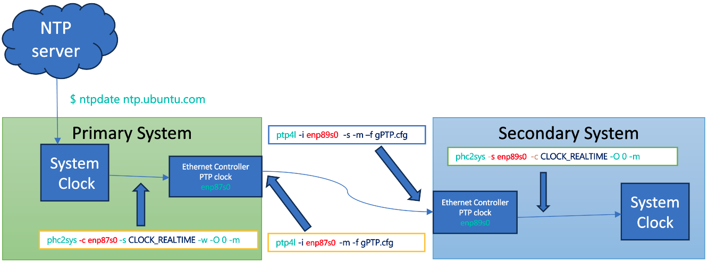

# Real-Clock Configuration in PTP-Supported Systems

Systems supporting PTP typically have two clocks: the system's real-time clock and another clock on the Ethernet card. The synchronization process involves:

1. **Primary System Real-Time Clock Synchronization**:
   - Initially synchronize the primary system's real-time clock with an NTP server.
   - Then sync the Ethernet PTP clock with the primary system's real-time clock.

2. **Secondary Systems Synchronization**:
   - Sync the secondary systems' Ethernet PTP clocks with the primary's Ethernet PTP clock.
   - Sync their system real-time clocks with their Ethernet PTP clocks, which are already synchronized with the primary system.

This setup ensures all secondary system's real-time clocks are synchronized with the primary system's real-time clock. Synchronization within a system (system real-time clock to Ethernet PTP clock) is managed using the `phc2sys` tool, while inter-system synchronization (across Ethernet interfaces) utilizes the `ptp4l` tool.

<div align="center">
  <figure>
	
	<figcaption><em>Figure: PTP4L Setup.</em></figcaption>
  </figure>
</div>

It's also important to turn off NTP time synchronization service by using this command:
 ```$ timedatectl set-ntp no```

### Command Sets for PTP time Synchronization

Assuming the primary Ethernet interface is named `enp87s0` and the secondary interface is named `enp89s0`, the following commands are to be executed under root or with sudo:

**Primary System Commands:**

- **ptp4l:**

```shell
$ ptp4l -i enp87s0 -m -f ./resources/gPTP.cfg
```

- **phc2sys:**

```shell
$ phc2sys -c enp87s0 -s CLOCK_REALTIME -w -O 0 -m -f ./resources/gPTP.cfg
```

**Secondary System Commands:**

- **ptp4l:**

```shell
$ ptp4l -i enp89s0 -s -m -f ./resources/gPTP.cfg
```

- **phc2sys:**

```shell
$ phc2sys -s enp89s0 -c CLOCK_REALTIME -O 0 -m -f ./resources/gPTP.cfg
```

The output of ptp4l on the primary system after running the above command should look
 like this:<br>

```console
ptp4l[13416.983]: selected /dev/ptp1 as PTP clock
ptp4l[13417.002]: port 1: INITIALIZING to LISTENING on INIT_COMPLETE
ptp4l[13417.003]: port 0: INITIALIZING to LISTENING on INIT_COMPLETE
ptp4l[13420.445]: port 1: LISTENING to MASTER on ANNOUNCE_RECEIPT_TIMEOUT_EXPIRES
ptp4l[13420.445]: selected local clock 844709.fffe.04f07f as best master
ptp4l[13420.445]: assuming the grand master role
```

The output of ptp4l on the secondary system after running the above command should
look like this:<br>

```console
ptp4l[14816.313]: selected /dev/ptp1 as PTP clock
ptp4l[14816.328]: port 1: INITIALIZING to LISTENING on INIT_COMPLETE
ptp4l[14816.328]: port 0: INITIALIZING to LISTENING on INIT_COMPLETE
ptp4l[14820.220]: port 1: new foreign master 844709.fffe.04f07f-1
ptp4l[14820.250]: selected local clock 844709.fffe.04eb0e as best master
ptp4l[14822.220]: selected best master clock 844709.fffe.04f07f
ptp4l[14822.220]: port 1: LISTENING to UNCALIBRATED on RS_SLAVE
ptp4l[14822.650]: port 1: UNCALIBRATED to SLAVE on MASTER_CLOCK_SELECTED
ptp4l[14823.275]: rms 158899 max 317730 freq -11742 +/- 3075 delay    14 +/-   0
ptp4l[14824.276]: rms  820 max 1257 freq  -9067 +/- 1113 delay    14 +/-   0
ptp4l[14825.277]: rms 1366 max 1436 freq  -6582 +/- 359 delay    13 +/-   0
ptp4l[14826.278]: rms  866 max 1148 freq  -6099 +/-  34 delay    13 +/-   0
ptp4l[14827.279]: rms  280 max  465 freq  -6364 +/- 102 delay    12 +/-   0
ptp4l[14828.280]: rms   52 max   80 freq  -6666 +/-  65 delay    12 +/-   0
ptp4l[14829.280]: rms   82 max   88 freq  -6805 +/-  21 delay    12 +/-   0
ptp4l[14830.281]: rms   50 max   69 freq  -6829 +/-   3 delay    12 +/-   0
ptp4l[14831.282]: rms   15 max   28 freq  -6811 +/-   7 delay    12 +/-   0
ptp4l[14832.283]: rms    4 max    8 freq  -6795 +/-   5 delay    12 +/-   0
ptp4l[14833.284]: rms    7 max   10 freq  -6783 +/-   3 delay    12 +/-   0
ptp4l[14834.285]: rms    2 max    5 freq  -6788 +/-   3 delay    13 +/-   0
ptp4l[14835.286]: rms    3 max    5 freq  -6793 +/-   3 delay    13 +/-   0
```

Please make it sure that the secondary sytem refers to the primary's precision time
 by checking if there is the **"new foreign master"** message in a log<br>
 Note that the rms value should be decreasing with each line and should go
 down to single digits.

For user convenience, an automation Bash script is available in the scripts folder to facilitate ptp4l synchronization on both primary and secondary systems. Users simply need to update the `config.sh` file with relevant details such as the secondary system's address, username, and Ethernet address, among others. After these updates, run the scripts/run_ptp.sh script from the primary system. This script will automatically execute the ptp4l and phc2sys tools on both the primary and secondary systems in their respective modes. Note that the script requires the secondary system to enable passwordless SSH to execute ptp4l commands through the SSH interface.

```console
$ ./scripts/run_ptp.sh
```

The console will display logs from both systems, but each process, including ptp4l and phc2sys, will also generate its own separate log file. These files can be found in the ./logs directory at the root level.

Since the ptp4l and phc2sys tools require root privileges or sudo access, users need to provide their sudo password in the config.sh file. As an alternative, setting up passwordless sudo can streamline this process. Here's how to enable passwordless sudo:

Open a terminal and type `sudo visudo` to edit the sudoers file.
Add the following line to the file at the end, replacing username with actual username:

```bash
username ALL=(ALL) NOPASSWD: ALL
```

Save and close the file to apply the changes.
This adjustment allows the automation scripts to run without requiring a sudo password each time, simplifying the setup for ptp4l and phc2sys synchronizations.
